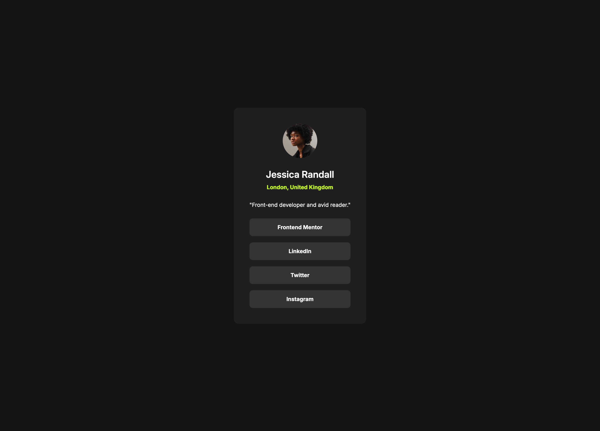

# Frontend Mentor - Social links profile solution

This is a solution to the [Social links profile challenge on Frontend Mentor](https://www.frontendmentor.io/challenges/social-links-profile-UG32l9m6dQ). Frontend Mentor challenges help you improve your coding skills by building realistic projects.

## Table of contents

- [Overview](#overview)
  - [Screenshot](#screenshot)
  - [Links](#links)
- [My process](#my-process)
  - [Built with](#built-with)
  - [What I learned](#what-i-learned)
- [Author](#author)
- [Acknowledgments](#acknowledgments)

## Overview

Third challenge from the "Getting started on Frontend Mentor" learning path.

### Screenshot



### Links

- Solution URL: [Social Links Profile - GitHub Repo](https://github.com/dealencardavid/social-links-profile_frontendmentor)
- Live Site URL: [Social Links Profile Live](https://dealencardavid.github.io/social-links-profile_frontendmentor/)

## My process

### Built with

- Semantic HTML5 markup
- CSS custom properties
- CSS Variants
- Media Query
- Flexbox

### What I learned

Simple media query to adapt padding for smaller screens. Opted to do it under 544px.

```css
@media (max-width: 544px) {
  main {
    padding: 0px var(--spacing-300);
  }

  .card {
    padding: var(--spacing-300);
  }
}
```

## Author

- Frontend Mentor - [@dealencardavid](https://www.frontendmentor.io/profile/dealencardavid)
- GitHub - [@dealencardavid](https://github.com/dealencardavid)

## Acknowledgments

Hats off to FrontendMentor for enabling goood resources to new frontend developers!
